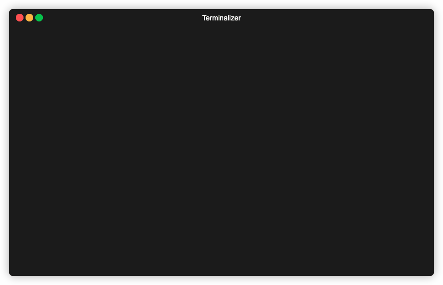

# atcoder-cli

Unofficial CLI for AtCoder users.

# Demo



## Features

* Template (built-in)
* Run test on Docker or Native
* Submit code to AtCoder
* Support major languages (If you want to add another languages, please send PR.)

# Install

## Linux

```shell
$ sudo curl -L -o /usr/local/bin/atcoder https://github.com/sachaos/atcoder/releases/download/v0.2.4/atcoder_linux_amd64 && sudo chmod +x /usr/local/bin/atcoder
```

## Mac OS X

```shell
$ brew install sachaos/atcoder/atcoder
```

## Build it yourself

You need go 1.13.

```shell
$ git clone https://github.com/sachaos/atcoder.git
$ cd atcoder
$ make install
```

# Setup

## Configure authentication information

```shell
$ atcoder config
```

**WARNING**: This software store raw authentication information on `~/.atcoder.toml`. This is not secure.
Please understand this behavior, and use carefully. Please contribute if you interest to fix this behavior.

## Install test runnder

```shell
$ atcoder install python3
```

# Usage

## Prepare to solve problems

```shell
$ atcoder prepare abc153
```

### Specify language to solve

```shell
$ atcoder prepare --language python3 abc153
```

## Browse problem (on web browser)

```shell
$ atcoder abc153/abc153_a browse
```

## Edit code

```shell
$ atcoder abc153/abc153_a edit
```

You can customize the editor by `$EDITOR` environment variable.

## Test

```shell
$ atcoder abc153/abc153_a test
```

## Submit if test passed

```shell
$ atcoder abc153/abc153_a submit
```

### Submit without test

```shell
$ atcoder abc153/abc153_a submit --skip-test
```

## Supporting Language

[AtCoder Languages and Compiler options](https://language-test-201603.contest.atcoder.jp/)

- C++14 (GCC 5.4.1)
    - Using gcc 5.4.0 docker image now.
    - You cannot use boost now.
- Go (1.6)
- Python2 (2.7.6)
    - You cannot use numpy, scipy, scikits now.
- Python3 (3.4.3)
    - You cannot use numpy, scipy, scikits now.
- Ruby (2.3.3)
- C (GCC 5.4.1)
    - Using gcc 5.4.0 docker image now.
- Java7 (OpenJDK 1.7.0)
- Java8 (OpenJDK 1.8.0)
